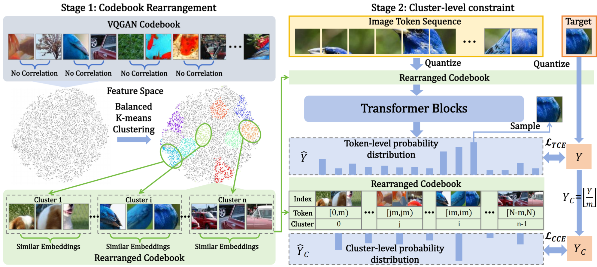

# Improving Autoregressive Visual Generation with Cluster-Oriented Token Prediction
###  [Paper](https://arxiv.org/abs/2501.00880) |   [Page](https://sjtuplayer.github.io/projects/IAR/)

<!--   -->
[Teng Hu](https://github.com/sjtuplayer), 
[Jiangning Zhang](https://zhangzjn.github.io/),
[Ran Yi](https://yiranran.github.io/),
[Jieyu Weng](https://github.com/sjtuplayer/MotionMaster),
[Yabiao Wang](https://scholar.google.com/citations?hl=zh-CN&user=xiK4nFUAAAAJ),
[Xianfang Zeng](https://github.com/sjtuplayer/MotionMaster),
[Zhucun Xue](https://github.com/sjtuplayer/MotionMaster),
and [Lizhuang Ma](https://dmcv.sjtu.edu.cn/) 
<!--   -->

### Code is coming soon.